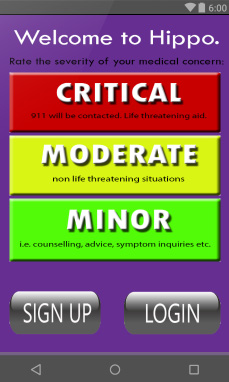

# Hippo

## Description

A potentially life-saving mobile app to request for nearby help in a crisis situation. Uses GPS, push notification service, and an external database to connect users with one another.

## Screenshots

## Contributors

Howard Fung, Miranda Pinto, Matt Pua, Eric Jadidzadeh
